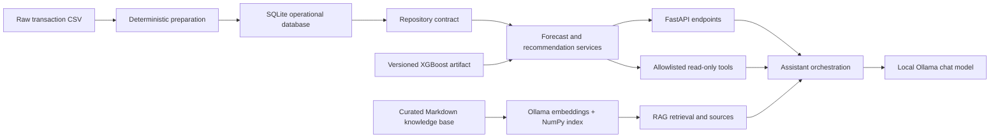
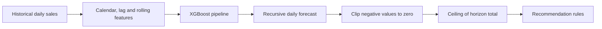
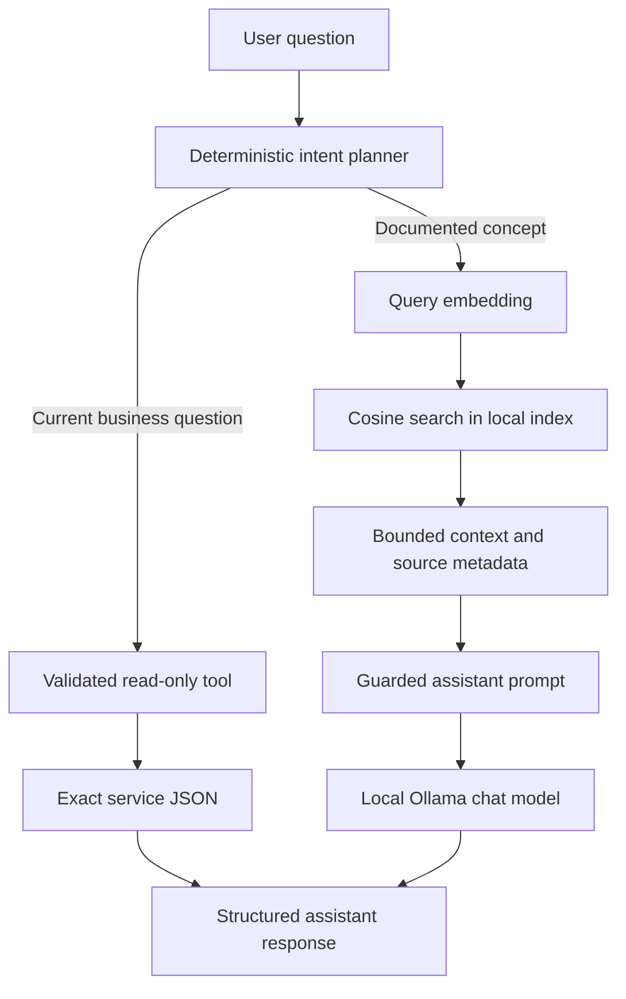

# MotoStock AI

MotoStock AI demonstrates an end-to-end demand forecasting and inventory
recommendation workflow for a small motorcycle and delivery-gear retail
scenario. It combines a saved XGBoost model, deterministic stock rules, a
FastAPI service, SQLite operational data, a local Ollama assistant and a small
RAG pipeline.

This is a portfolio and learning project. It is not presented as a finished
enterprise platform or as an autonomous purchasing system.

## Project overview

The project answers two related questions:

1. How much of each product may be sold over a future horizon?
2. Given that forecast, current stock and supplier lead time, should the store
   review a replenishment order?

The responsibilities are intentionally separate:

| Component | Responsibility |
| --- | --- |
| XGBoost | Predicts daily product demand. |
| Recommendation engine | Calculates replenishment quantities and stock status. |
| SQLite/repository | Stores operational products, sales, inventory and results. |
| RAG | Provides documented, relatively stable project knowledge. |
| Read-only tools | Provide current business values from application services. |
| Local LLM | Explains the system and presents grounded results. |
| FastAPI | Validates requests and exposes the workflow over HTTP. |

The model does not place orders. The LLM does not become a source of current
inventory data and does not receive arbitrary code execution or arbitrary tool
access.

## Business problem

Retailers need enough stock to avoid stockouts without tying up too much cash in
slow-moving inventory. Manual decisions can rely too heavily on recent sales or
incomplete information. MotoStock AI provides decision-support outputs for
store owners, inventory managers and purchasing teams.

The outputs should be reviewed together with supplier availability, budget,
promotions, stockouts, local knowledge and unusual events. Forecasts and
recommendations are estimates, not guarantees.

## Main features

- Recursive 1–30 day product-demand forecasts from a saved XGBoost pipeline.
- Product-level stock recommendations with safety stock and supplier lead time.
- Versioned SQLite schema with idempotent sales ingestion and persisted runs.
- Operational refresh that rebuilds leakage-safe features and recommendations.
- Candidate model training, evaluation gates, promotion and rollback scripts.
- Curated Markdown knowledge base, Ollama embeddings and a local NumPy vector
  index.
- Deterministic, allowlisted read-only assistant tools.
- Structured assistant provenance: `tools_used` and retrieved `sources`.
- Reproducible deterministic/live evaluation assets for RAG, tools and safety.
- Docker image and Compose setup with optional Ollama container support.

## Architecture



The route layer is thin. Services hold business behavior, repositories isolate
data access, and training code is separate from serving code. The default
runtime backend is SQLite; CSV remains the explicit import source and a
read-only development backend.

## How the components work

### Forecasting flow



XGBoost predicts demand. The recommendation engine then combines the forecast
with current stock, safety stock and supplier lead time. The model does not
calculate a purchase order by itself.

### Assistant flow



The planner is deterministic rather than an unconstrained model-generated
function call. A current-data request returns the allowlisted tool result
directly. A conceptual request can use static RAG context and the local model.
Mixed requests can return both tool provenance and documented source metadata.

## ML workflow

### Dataset

The tracked demo dataset is `data/raw/motoretail.csv`. It contains 6,875
transaction rows, 12 products and dates from 2025-01-01 to 2026-05-29. The
preparation script aggregates transactions into a complete product/day grid and
writes ignored serving files:

| Artifact | Rows | Purpose |
| --- | ---: | --- |
| `data/processed/daily_product_sales.csv` | 6,168 | Daily operational history, including zero-demand days. |
| `data/processed/modeling_dataset.csv` | 6,000 | Rows with all leakage-safe features available. |

The processed files are generated, ignored by Git and reproducible from the
raw CSV:

```powershell
.venv\Scripts\python.exe -m scripts.prepare_data
```

```bash
python -m scripts.prepare_data
```

### Feature engineering

The target is `quantity_sold` for one product on one day. The pipeline uses:

- previous unit price;
- day of week, day of month, month and ISO week;
- weekend indicator;
- 1-day, 7-day and 14-day demand lags;
- 1-day, 7-day and 14-day rolling demand means;
- `product_name` as a one-hot categorical feature.

Feature calculations shift historical values before computing rolling means, so
the current target is not used to predict itself. Training uses a date-disjoint
80/20 temporal split and seed 42. Multi-day serving forecasts are recursive:
each predicted day can become history for the next day, so errors can
accumulate across the horizon.

### Model evaluation

The evaluation compares the saved Random Forest and XGBoost pipelines on the
same temporal holdout. These are the recorded aggregate metrics; lower is
better for every column.

| Model | MAE | RMSE | MAPE | WAPE |
| --- | ---: | ---: | ---: | ---: |
| Random Forest | 1.321885 | 1.849646 | 63.501327% | 81.850435% |
| XGBoost | 1.296611 | 1.869340 | 62.575466% | 80.285498% |

XGBoost was selected because it has the lower MAE, MAPE and WAPE. Random
Forest has a slightly lower RMSE, so the selection is a business-metric tradeoff
and not a claim that XGBoost is universally better.

The product-level report shows why aggregate metrics are not enough. For
`Bag Delivery 45L`, the XGBoost holdout total was 338.206726 units versus 402
actual units, an underprediction of 63.793274 units. Safety stock and product
level review are therefore part of the design.

### Known model limitations

- Historical data quality limits forecast quality.
- New products have a cold-start problem.
- Promotions, stockouts, supplier shortages and unusual events are not fully
  represented in the current features.
- MAPE is difficult to interpret for zero or very small actual demand.
- Recursive error can accumulate over longer horizons.
- Aggregate metrics can hide product-specific underprediction or overprediction.
- A forecast is a decision-support estimate, not a guarantee.

## Recommendation rules

The deterministic engine applies these documented formulas after forecasting:

```text
forecasted_demand_units = ceil(sum(max(daily_forecast, 0)))
safety_stock = ceil(forecasted_demand_units * 0.20)
required_stock = forecasted_demand_units + safety_stock
recommended_purchase_quantity = max(0, required_stock - current_stock)
```

Stock status is interpreted as follows:

| Status | Rule |
| --- | --- |
| `critical` | `current_stock < forecasted_demand_units` |
| `warning` | Demand is covered, but safety stock is not. |
| `healthy` | `current_stock >= required_stock` and not overstock. |
| `overstock` | `current_stock > required_stock * 1.5`. |

Supplier lead time and stock urgency contribute to `priority_score`. These
values support review; they are not automatic purchase orders.

## FastAPI endpoints

The interactive OpenAPI documentation is available at `/docs` and ReDoc at
`/redoc` after the service starts.

| Method | Endpoint | Purpose |
| --- | --- | --- |
| GET | `/health` | API process and forecasting model status. |
| GET | `/products` | List known products. |
| POST | `/predict` | Forecast one known product for 1–30 days. |
| GET | `/recommendations` | Generate current recommendations. |
| GET | `/recommendations/latest` | Read the latest persisted completed run. |
| GET | `/recommendations/summary` | Read aggregate recommendation counts. |
| POST | `/recommendations/refresh` | Rebuild features and persist a run. |
| POST | `/sales` | Insert one idempotent operational sale. |
| POST | `/sales/batch` | Insert a transactional idempotent batch. |
| GET | `/models` | List registered model versions. |
| POST | `/models/{version}/promote` | Explicitly promote a candidate after gates. |
| POST | `/models/{version}/rollback` | Restore a previous production model. |
| GET | `/assistant/health` | Check Ollama and configured chat model. |
| POST | `/assistant/chat` | Ask a grounded assistant question. |

Typical status behavior:

| Status | Meaning |
| ---: | --- |
| 200 | Successful read, prediction, refresh or assistant response. |
| 201 | Sale or batch accepted; repeated idempotent writes are reported as skipped. |
| 404 | Unknown product, model version or missing persisted recommendation. |
| 422 | Invalid request body, product horizon, price, quantity or idempotency key. |
| 502/503/504 | Upstream Ollama, model, data or timeout failure, with a safe detail message. |

## MotoBoy POS integration

The MotoBoy POS is the transactional source of truth for products, sales and
local stock. It sends a one-way analytical copy to MotoStock AI through the
Tauri Rust client; the React UI never calls FastAPI directly. MotoStock AI does
not write back to the POS database or change local stock.

The existing `POST /sales/batch` contract accepts mapped POS sale items. Stock
changes that are not sales use these additional contracts:

| Method | Endpoint | Purpose |
| --- | --- | --- |
| POST | `/inventory/snapshots` | Ingest one timestamped stock observation. |
| POST | `/inventory/snapshots/batch` | Ingest up to 1000 observations transactionally. |

Example snapshot:

```json
{
  "product_name": "Bag Delivery 45L",
  "quantity_on_hand": 10,
  "supplier_lead_time_days": 7,
  "observed_at": "2026-08-03T18:30:00Z",
  "external_id": "motoboy-pos:stock-movement:27",
  "idempotency_key": "motoboy-pos:stock-movement:27"
}
```

`product_name` must already exist in the MotoStock catalog. The quantity cannot
be negative, lead time must be at least one day, `observed_at` must include a
timezone, and one of `external_id` or `idempotency_key` is required. Batches are
bounded at 1000 records and are committed as one transaction. The response
reports `inserted`, `skipped`, `updated` and `snapshot_ids`.

Retries are safe because the event key is stored with the snapshot and checked
before insertion. Every accepted event is retained, including a delayed event;
the recommendation repository selects the greatest `observed_at` per product,
so an older event cannot replace a newer stock value. Schema migration 5 adds
timestamp precision and event identity while preserving existing date-based
inventory rows.

Recommended startup order is: initialize/import the MotoStock SQLite database,
start FastAPI, confirm `/health`, then start the POS. If FastAPI or SQLite is
unavailable, the POS must keep the event in its local outbox and retry later.
The AI service is analytical only: recommendations, forecasts and assistant
responses are consultive and never mutate POS stock.

For troubleshooting, check that the mapped product name is returned by
`GET /products`, inspect the safe HTTP detail for `422` validation errors, and
retry a `503` after the local SQLite/API dependency is available. Do not copy
the POS SQLite file into this project; send explicit events over the API.

## SQLite and operational refresh

SQLite is the operational default. The versioned schema stores products,
suppliers, sales, inventory snapshots, modeling rows, recommendation runs,
stock recommendations, model versions and application runs. Foreign keys,
constraints, indexes, transactions and a SQLite busy timeout are enabled.

Initialize/import from a clean checkout:

```powershell
.venv\Scripts\python.exe -m scripts.prepare_data
.venv\Scripts\python.exe -m scripts.init_database
.venv\Scripts\python.exe -m scripts.import_csv_data
```

```bash
python -m scripts.prepare_data
python -m scripts.init_database
python -m scripts.import_csv_data
```

The import is transactional and idempotent. New sales require a positive
quantity, a positive price and an `external_id`, `idempotency_key` or
`Idempotency-Key` header. A duplicate key is skipped rather than inserted
again. Refresh rebuilds the feature table, forecasts all products and persists
the recommendation result under a deterministic run key.


There is no Celery or Redis requirement. The refresh service uses a simple
in-process lock; deployments that need multiple workers should add an external
coordination strategy before treating this as a production scheduler.

## Model retraining and versioning

Training is deliberately an administrative/script workflow, not a request-time
API operation:

```powershell
.venv\Scripts\python.exe -m scripts.train_model --model xgboost
.venv\Scripts\python.exe -m scripts.evaluate_candidate --artifact artifacts/models/candidates/<version>.pkl
.venv\Scripts\python.exe -m scripts.promote_model <version>
.venv\Scripts\python.exe -m scripts.rollback_model <production-version>
```

```bash
python -m scripts.train_model --model xgboost
python -m scripts.evaluate_candidate --artifact artifacts/models/candidates/<version>.pkl
python -m scripts.promote_model <version>
python -m scripts.rollback_model <production-version>
```

Candidates are saved outside `artifacts/models/xgboost_model.pkl`. Metadata
records the version, seed, parameters, data interval, feature columns,
metrics, parent version and SHA-256 checksum. Promotion checks candidate MAE,
product-level signed-error regressions and artifact smoke loading. Promotion is
explicit; a candidate never silently overwrites production. Rollback restores
the recorded parent artifact and keeps a backup.

## Ollama setup

The assistant is local and uses Ollama rather than a hosted LLM by default.
Install the chat and embedding models:

```bash
ollama pull qwen3:4b
ollama pull qwen3-embedding:0.6b
ollama serve
```

The Ollama desktop application may already run the service on Windows. Do not
start a second server on the same port. Copy `.env.example` to `.env` and
adjust only local values:

| Variable | Purpose | Example |
| --- | --- | --- |
| `OLLAMA_BASE_URL` | Ollama HTTP base URL. | `http://localhost:11434` |
| `OLLAMA_MODEL` | Chat model. | `qwen3:4b` |
| `OLLAMA_EMBEDDING_MODEL` | Embedding model. | `qwen3-embedding:0.6b` |
| `OLLAMA_TIMEOUT_SECONDS` | Request timeout. | `60` |
| `DATA_BACKEND` | `sqlite` or read-only `csv`. | `sqlite` |
| `DATABASE_PATH` | SQLite file path. | `storage/motostock.db` |
| `AUTO_IMPORT_CSV` | Prepare/import an empty SQLite file. | `true` |
| `RAG_KNOWLEDGE_BASE_PATH` | Markdown knowledge directory. | `knowledge_base` |
| `RAG_STORAGE_PATH` | Generated index directory. | `storage/rag` |
| `RAG_CHUNK_SIZE` | Chunk size in characters. | `1000` |
| `RAG_CHUNK_OVERLAP` | Chunk overlap in characters. | `150` |
| `RAG_DEFAULT_TOP_K` | Default retrieved chunks. | `4` |
| `RAG_MAX_TOP_K` | Maximum retrieved chunks. | `10` |
| `RAG_MIN_SCORE` | Minimum cosine score; empty disables thresholding. | `0.40` |
| `RAG_MAX_CONTEXT_CHARS` | Maximum retrieved context sent to the LLM. | `6000` |

Do not commit `.env`. The API has no authentication layer, so keep a local
instance on a trusted network.

## RAG architecture

The knowledge base is curated Markdown under `knowledge_base/`. The current
local index was built from seven documents and 73 chunks using
`qwen3-embedding:0.6b`; its checksum and other metadata are recorded in
`storage/rag/index_info.json`. The index stores normalized NumPy vectors and
source metadata. It is not a hosted vector database.

Build or replace it after Ollama and the embedding model are available:

```powershell
.venv\Scripts\python.exe -m scripts.index_knowledge_base
.venv\Scripts\python.exe -m scripts.check_rag_retrieval
```

```bash
python -m scripts.index_knowledge_base
python -m scripts.check_rag_retrieval
```

RAG provides documented definitions, architecture, model evaluation, rules and
limitations. It must not provide current stock, current forecasts or current
purchase quantities. Retrieved text is bounded and marked as untrusted
reference context before it reaches the model. `sources` returns document,
section, chunk and score metadata.

## Tool calling and guardrails

The assistant exposes only these read-only operations:

- `list_products`
- `forecast_product`
- `get_recommendations`
- `get_recommendation_summary`

Arguments use strict Pydantic schemas. Product names are checked against the
repository, horizons are limited to 1–30 days, and results are serialized from
the service output. Tools do not call the API over HTTP, evaluate user code or
accept arbitrary tool names. English and Portuguese intent aliases are covered
by deterministic tests.

If the data service, model or Ollama dependency is unavailable, the API returns
a controlled error or says that it cannot verify the current value. It must not
invent a plausible product, quantity, status or recommendation.

## Installation and running locally

### Windows PowerShell

```powershell
python -m venv .venv
.venv\Scripts\Activate.ps1
pip install -r requirements-dev.txt
Copy-Item .env.example .env
.venv\Scripts\python.exe -m scripts.prepare_data
.venv\Scripts\python.exe -m scripts.init_database
.venv\Scripts\python.exe -m scripts.import_csv_data
.venv\Scripts\python.exe -m uvicorn api.main:app --reload
```

### Linux/macOS

```bash
python3 -m venv .venv
source .venv/bin/activate
pip install -r requirements-dev.txt
cp .env.example .env
python -m scripts.prepare_data
python -m scripts.init_database
python -m scripts.import_csv_data
python -m uvicorn api.main:app --reload
```

The API is then available at `http://127.0.0.1:8000`. Open `/docs` for Swagger.
The empty SQLite database can also bootstrap itself from the tracked raw CSV
when `AUTO_IMPORT_CSV=true`.

## Docker

The image uses Python 3.11 and installs only runtime dependencies. Its command
prepares the generated CSVs, initializes/imports SQLite and starts Uvicorn as a
non-root user. `motostock_storage` persists SQLite and the RAG index.

```bash
docker compose build api
docker compose up api
curl http://127.0.0.1:8000/health
```

By default the API container connects to host Ollama at
`http://host.docker.internal:11434`. If a local `.env` overrides that with
`localhost`, set the container value explicitly:

```powershell
$env:OLLAMA_BASE_URL="http://host.docker.internal:11434"
docker compose up --build api
```

Ollama can instead run in the optional Compose profile. This setup does not
configure a GPU and does not download models automatically:

```powershell
$env:OLLAMA_BASE_URL="http://ollama:11434"
docker compose --profile ollama up --build
docker compose exec ollama ollama pull qwen3:4b
docker compose exec ollama ollama pull qwen3-embedding:0.6b
docker compose exec api python -m scripts.index_knowledge_base
```

The Docker files were parsed and inspected in this workspace, but an actual
`docker build`/`docker compose up` was not possible here because Docker is not
installed. Run those commands on a machine with Docker Desktop or Docker
Engine before using the container setup.

## Running tests

The real Ollama check is not part of the quick suite.

```bash
# Unit-oriented checks
python -m pytest -m "not integration and not e2e and not manual" -q

# SQLite/API integration checks
python -m pytest -m integration -q

# Complete temporary-database workflow
python -m pytest -m e2e -q

# All local tests; manual Ollama remains skipped unless opted in
python -m pytest -q
```

Opt into the real model check only when Ollama is running:

```powershell
$env:RUN_OLLAMA_TESTS="1"
python -m pytest -m manual -q
python -m scripts.check_ollama_integration
```

The versioned assistant evaluation is separate from pytest:

```bash
python -m scripts.evaluate_assistant
python -m scripts.evaluate_assistant --live
```

Deterministic evaluation checks source catalogs, tool choice and arguments,
invalid inputs, missing index behavior and injection handling. Live evaluation
records latency and provenance but intentionally leaves subjective answer
quality and numerical fidelity as manual review items. Reports are written to
the ignored `evaluation/results/` directory as Markdown, CSV and JSON.

## Example questions and requests

English conceptual question:

```bash
curl -X POST http://127.0.0.1:8000/assistant/chat \
  -H "Content-Type: application/json" \
  -d '{"message":"Why was XGBoost selected?"}'
```

Portuguese current-data question:

```bash
curl -X POST http://127.0.0.1:8000/assistant/chat \
  -H "Content-Type: application/json" \
  -d '{"message":"Quais produtos estão críticos agora?"}'
```

On Windows `cmd.exe`, use `^` for line continuation and escape the JSON quotes
as shown in the PowerShell-friendly commands below:

```powershell
curl.exe -X POST http://127.0.0.1:8000/predict `
  -H "Content-Type: application/json" `
  -d '{"product_name":"Bag Delivery 45L","horizon_days":14}'

curl.exe "http://127.0.0.1:8000/recommendations?stock_status=critical"

curl.exe -X POST http://127.0.0.1:8000/sales `
  -H "Content-Type: application/json" `
  -d '{"product_name":"Bag Delivery 45L","sale_date":"2026-01-01","quantity_sold":2,"unit_price_brl":182.5,"external_id":"demo-sale-1"}'
```

The API response for assistant calls includes `sources` for static references
and `tools_used` for current business operations. Tool output is application
data, not an LLM-generated number.

## Project structure

```text
api/
  main.py                 FastAPI app and startup lifecycle
  config.py               validated environment settings
  database.py             SQLite schema and migrations
  routes/                 HTTP endpoints
  schemas/                Pydantic request/response models
  services/               forecast, recommendation, RAG, Ollama and tools
  repositories/           CSV and SQLite data access
  prompts/                assistant system prompt
src/
  data_preparation.py     reproducible raw-to-processed data preparation
  training/               leakage-safe features, training and promotion gates
  forecasting.py          recursive forecast implementation
  recommendation.py       deterministic stock rules
scripts/                  operational, training and evaluation commands
knowledge_base/           curated RAG documents
evaluation/               versioned RAG, tool and safety cases
data/raw/                 tracked demo transactions
data/processed/           generated and ignored serving CSVs
artifacts/models/         saved production model and ignored candidates
tests/                    unit, integration, E2E and manual checks
Dockerfile                FastAPI runtime image
docker-compose.yml        API plus optional Ollama services
```

## Security and guardrails

- `.env` is ignored; `.env.example` contains placeholders and local defaults.
- The assistant prompt treats retrieved text as untrusted reference data.
- Tools are read-only, allowlisted and argument-validated.
- Current business values come from repository/services, not static RAG text.
- HTTP errors expose controlled details rather than tracebacks.
- Sales writes require idempotency and execute in transactions.
- Model artifacts are trusted local files; do not load arbitrary joblib files.
- The API has no authentication, authorization, rate limiting or audit identity.
  Keep it on a trusted local network and add those controls before exposure.
- SQLite persistence and refresh coordination are intentionally small and are
  not a substitute for a multi-worker operations platform.

Prompt injection cannot be eliminated by the current design. The explicit
allowlist, bounded context and separation between RAG and tools reduce the
impact of common cases but still require review.

## Current limitations

The current repository does not include authentication, a frontend, scheduled
workers, distributed locks, production monitoring, automatic retraining or a
hosted vector database. Ollama must be available for live assistant/RAG calls.
The local NumPy index must be rebuilt when knowledge documents or embedding
models change. The demo dataset and model metrics should not be interpreted as
evidence of production performance.

The default RAG index is a generated local artifact and is intentionally not
versioned. A clean checkout can run the API and business services after data
preparation, but it must run the index command when Ollama is available to
enable semantic retrieval.

No frontend was implemented in the mandatory phases. A small dashboard is a
future option, not a hidden dependency of the backend release.

## Future improvements

- Add authentication, authorization and request auditing.
- Add drift, forecast-error and data-quality monitoring.
- Calibrate safety stock and evaluate forecast horizons by product.
- Add a scheduler or external job runner for refresh with multi-worker locking.
- Use a managed/vector database only if the corpus requires it.
- Add a small dashboard for products, recommendations, sources and chat.
- Add CI Docker build checks on a runner with Docker.
- Add a controlled model registry backend for multiple environments.

## Branch structure

The implementation was delivered without merging or force-pushing the phase
branches:

```text
llm-rag-assistant
    └── sqlite-integration
          └── model-operations
                └── portfolio-release
```

The release branch contains the completed backend, ML operations, evaluation,
E2E, Docker and documentation work. Historical branches remain available for
review.

## Author and portfolio context

This repository is a portfolio demonstration of practical ML application work:
data preparation, leakage-safe feature engineering, model evaluation, API
design, local LLM integration, operational persistence and guarded automation.
It is intentionally small enough to inspect end to end and explicit about what
is and is not production-grade.

Author: Henrique Caeiro

## License

This project is released under the [MIT License](LICENSE).
