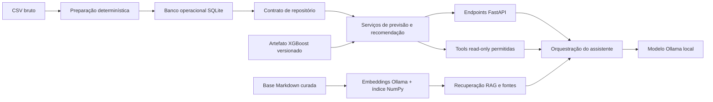
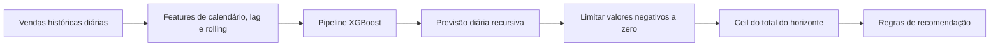
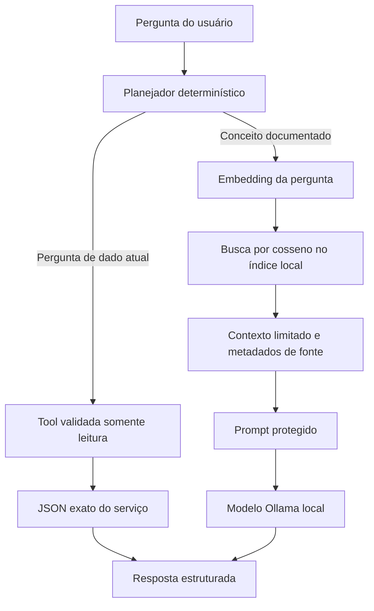
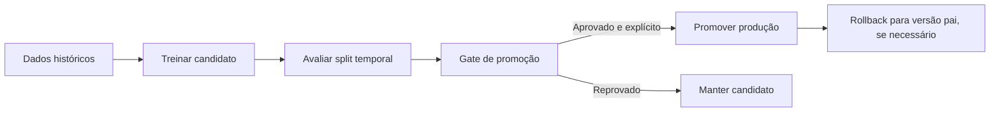

# MotoStock AI

O MotoStock AI demonstra um fluxo completo de previsão de demanda e
recomendação de estoque para um cenário de varejo de motocicletas e produtos
para entrega. O projeto combina um modelo XGBoost salvo, regras determinísticas
de estoque, uma API FastAPI, dados operacionais em SQLite, um assistente local
com Ollama e um pequeno pipeline de RAG.

Este é um projeto de portfólio e aprendizado. Ele não é apresentado como uma
plataforma enterprise pronta nem como um sistema autônomo de compras.

## 1. Visão geral do projeto

O projeto responde a duas perguntas relacionadas:

1. Quanto de cada produto pode ser vendido em um horizonte futuro?
2. Considerando a previsão, o estoque atual e o prazo do fornecedor, é preciso
   revisar uma reposição?

As responsabilidades são separadas de propósito:

| Componente | Responsabilidade |
| --- | --- |
| XGBoost | Prevê a demanda diária dos produtos. |
| Motor de recomendação | Calcula reposição, status de estoque e prioridade. |
| SQLite/repositório | Armazena produtos, vendas, estoque e resultados operacionais. |
| RAG | Fornece conhecimento documentado e relativamente estável. |
| Tools read-only | Consultam valores atuais nos serviços da aplicação. |
| LLM local | Explica o sistema e apresenta resultados com contexto. |
| FastAPI | Valida requisições e expõe o fluxo por HTTP. |

O modelo não cria pedidos de compra. O LLM não é fonte de estoque atual e não
recebe acesso arbitrário a código ou ferramentas.

## 2. Problema de negócio

Lojas precisam manter estoque suficiente para evitar rupturas sem prender
capital demais em produtos de baixa saída. Decisões manuais podem depender
excessivamente das vendas recentes ou de informações incompletas. O MotoStock
AI oferece saídas de apoio à decisão para proprietários, responsáveis por
estoque e compras.

Os resultados devem ser revisados junto com disponibilidade de fornecedores,
orçamento, promoções, rupturas, conhecimento local e eventos incomuns.
Previsões e recomendações são estimativas, não garantias.

## 3. Principais recursos

- Previsão recursiva de demanda de 1 a 30 dias com pipeline XGBoost salvo.
- Recomendação de estoque por produto com estoque de segurança e lead time.
- Schema SQLite versionado com ingestão idempotente de vendas e runs persistidos.
- Refresh operacional que reconstrói features sem leakage e recomendações.
- Treino de candidatos, gates de avaliação, promoção e rollback.
- Base Markdown, embeddings Ollama e índice vetorial local em NumPy.
- Tools determinísticas, allowlisted e somente leitura.
- Proveniência estruturada em `tools_used` e `sources`.
- Avaliação reproduzível de RAG, tools, segurança e limitações.
- Imagem Docker e Compose com suporte opcional a Ollama em container.

## 4. Arquitetura



A camada de rotas é fina. Os serviços concentram o comportamento de negócio,
os repositórios isolam o acesso a dados e o código de treinamento é separado
do serving. SQLite é o backend padrão; CSV continua disponível como fonte
explícita de importação e backend de desenvolvimento somente leitura.

## 5. Como os componentes funcionam

### Fluxo de previsão



O XGBoost prevê a demanda. O motor de recomendação combina a previsão com
estoque atual, estoque de segurança e lead time. O modelo não calcula sozinho
uma ordem de compra.

### Fluxo do assistente



O planejador é determinístico, e não uma chamada irrestrita gerada pelo
modelo. Perguntas de dados atuais retornam diretamente resultados das tools
permitidas. Perguntas conceituais podem usar contexto RAG e o modelo local.

## 6. Fluxo de machine learning

O alvo é `quantity_sold` por produto e dia. A preparação cria a grade completa
de produto/dia, explicita dias sem venda e calcula features apenas com
informação anterior ao alvo. O treino usa divisão temporal 80/20 sem
interseção de datas e seed 42.

Na execução, o horizonte é recursivo: a previsão de um dia pode entrar no
histórico temporário do dia seguinte. Portanto, erros podem se acumular em
horizontes maiores.

## 7. Dataset

O dataset de demonstração versionado é `data/raw/motoretail.csv`. Ele possui
6.875 transações, 12 produtos e datas de 2025-01-01 a 2026-05-29.

| Artefato | Linhas | Uso |
| --- | ---: | --- |
| `data/processed/daily_product_sales.csv` | 6.168 | Histórico diário, incluindo dias com demanda zero. |
| `data/processed/modeling_dataset.csv` | 6.000 | Linhas com todas as features disponíveis. |

Os CSVs processados são gerados e ignorados pelo Git, mas podem ser
reproduzidos a partir do CSV bruto:

```powershell
.venv\Scripts\python.exe -m scripts.prepare_data
```

```bash
python -m scripts.prepare_data
```

## 8. Feature engineering

O pipeline usa:

- preço unitário anterior;
- dia da semana, dia do mês, mês e semana ISO;
- indicador de fim de semana;
- lags de demanda de 1, 7 e 14 dias;
- médias móveis de demanda de 1, 7 e 14 dias;
- `product_name` como feature categórica one-hot.

As features deslocam os valores históricos antes das médias móveis, evitando
que o alvo do próprio dia entre no cálculo. O pipeline de serving mantém a
previsão diária contínua e limita valores negativos a zero somente para uso
operacional.

## 9. Avaliação do modelo

Os pipelines Random Forest e XGBoost foram comparados na mesma divisão temporal.
Os números abaixo são os registrados no relatório; quanto menor, melhor.

| Modelo | MAE | RMSE | MAPE | WAPE |
| --- | ---: | ---: | ---: | ---: |
| Random Forest | 1.321885 | 1.849646 | 63.501327% | 81.850435% |
| XGBoost | 1.296611 | 1.869340 | 62.575466% | 80.285498% |

No holdout, para `Bag Delivery 45L`, o XGBoost previu 338.206726 unidades
contra 402 unidades observadas: subestimação de 63.793274 unidades. Esse caso
mostra por que métricas agregadas não substituem a avaliação por produto.

## 10. Por que XGBoost foi selecionado

XGBoost foi selecionado porque apresentou MAE, MAPE e WAPE menores. O Random
Forest teve RMSE ligeiramente menor, então a escolha é um trade-off de métricas
de negócio e não uma afirmação de que XGBoost é sempre superior.

O modelo selecionado está em `artifacts/models/xgboost_model.pkl`. O artefato
é carregado pela API, e candidatos de novos treinos ficam fora desse caminho.

## 11. Limitações conhecidas do modelo

- Qualidade histórica limita diretamente a qualidade da previsão.
- Produtos novos sofrem com cold start.
- Promoções, rupturas, falta de fornecedor e eventos incomuns não estão
  plenamente representados nas features atuais.
- MAPE é difícil de interpretar com valores reais zero ou muito pequenos.
- O erro recursivo pode aumentar em horizontes longos.
- Métricas agregadas podem esconder erros por produto.
- A previsão é um apoio à decisão, não uma garantia.

## 12. Regras de recomendação

Depois da previsão, o motor determinístico aplica:

```text
forecasted_demand_units = ceil(sum(max(daily_forecast, 0)))
safety_stock = ceil(forecasted_demand_units * 0.20)
required_stock = forecasted_demand_units + safety_stock
recommended_purchase_quantity = max(0, required_stock - current_stock)
```

| Status | Regra |
| --- | --- |
| `critical` | `current_stock < forecasted_demand_units` |
| `warning` | A demanda está coberta, mas o estoque de segurança não. |
| `healthy` | `current_stock >= required_stock` e não é excesso. |
| `overstock` | `current_stock > required_stock * 1.5`. |

Lead time e urgência de estoque participam do `priority_score`. O resultado
apoia a revisão e não cria uma ordem de compra automática.

## 13. Endpoints FastAPI

Depois de iniciar o serviço, a documentação OpenAPI fica em `/docs` e o ReDoc
em `/redoc`.

| Método | Endpoint | Uso |
| --- | --- | --- |
| GET | `/health` | Status do processo e do modelo de previsão. |
| GET | `/products` | Lista produtos conhecidos. |
| POST | `/predict` | Prevê um produto conhecido por 1–30 dias. |
| GET | `/recommendations` | Gera recomendações atuais. |
| GET | `/recommendations/latest` | Lê o último run concluído persistido. |
| GET | `/recommendations/summary` | Lê os totais por status. |
| POST | `/recommendations/refresh` | Reconstrói features e persiste um run. |
| POST | `/sales` | Insere uma venda idempotente. |
| POST | `/sales/batch` | Insere um lote transacional idempotente. |
| GET | `/models` | Lista versões de modelo registradas. |
| POST | `/models/{version}/promote` | Promove explicitamente um candidato aprovado. |
| POST | `/models/{version}/rollback` | Restaura um modelo anterior. |
| GET | `/assistant/health` | Verifica Ollama e o modelo configurado. |
| POST | `/assistant/chat` | Envia pergunta ao assistente. |

Respostas principais:

| HTTP | Significado |
| ---: | --- |
| 200 | Leitura, previsão, refresh ou resposta do assistente concluídos. |
| 201 | Venda/lote aceito; duplicatas idempotentes são informadas como ignoradas. |
| 404 | Produto, versão de modelo ou run persistido não encontrado. |
| 422 | Corpo, horizonte, preço, quantidade ou chave inválida. |
| 502/503/504 | Falha controlada de Ollama, modelo, dados ou timeout. |

## Integração com MotoBoy POS

O MotoBoy POS é a fonte transacional de verdade para produtos, vendas e estoque
local. Ele envia uma cópia analítica unidirecional ao MotoStock AI por meio do
cliente Rust do Tauri; a interface React não chama a FastAPI diretamente. O
MotoStock AI não escreve no banco do POS nem altera o estoque local.

O contrato existente `POST /sales/batch` recebe itens de vendas com mapping.
Alterações de estoque que não são vendas usam estes contratos adicionais:

| Método | Endpoint | Objetivo |
| --- | --- | --- |
| POST | `/inventory/snapshots` | Receber uma observação de estoque com timestamp. |
| POST | `/inventory/snapshots/batch` | Receber até 1000 observações em uma transação. |

Exemplo de snapshot:

```json
{
  "product_name": "Bag Delivery 45L",
  "quantity_on_hand": 10,
  "supplier_lead_time_days": 7,
  "observed_at": "2026-08-03T18:30:00Z",
  "external_id": "motoboy-pos:stock-movement:27",
  "idempotency_key": "motoboy-pos:stock-movement:27"
}
```

`product_name` precisa existir no catálogo do MotoStock. A quantidade não pode
ser negativa, o lead time deve ser de pelo menos um dia, `observed_at` precisa
conter fuso horário e `external_id` ou `idempotency_key` é obrigatório. Batches
são limitados a 1000 registros e gravados em uma única transação. A resposta
informa `inserted`, `skipped`, `updated` e `snapshot_ids`.

Retries são seguros porque a chave do evento é persistida e verificada antes da
inserção. Cada evento aceito é mantido, inclusive um evento atrasado; o
repositório de recomendações seleciona o maior `observed_at` por produto, então
um evento antigo não substitui um saldo mais novo. A migration 5 adiciona
precisão de timestamp e identidade do evento sem apagar os registros antigos
baseados apenas em data.

A ordem recomendada é: inicializar/importar o SQLite do MotoStock, iniciar a
FastAPI, confirmar `/health` e então iniciar o POS. Se a FastAPI ou o SQLite
estiver indisponível, o POS deve manter o evento na outbox local e tentar depois.
O serviço de IA é apenas analítico: recomendações, previsões e respostas do
assistant são consultivas e nunca alteram o estoque do POS.

Para troubleshooting, confirme que o nome mapeado aparece em `GET /products`,
leia o detalhe HTTP seguro em erros `422` e repita erros `503` depois que a
dependência local estiver disponível. Não copie o arquivo SQLite do POS para
este projeto; envie eventos explícitos pela API.

## 14. Configuração do Ollama

O assistente usa Ollama local, não um LLM hospedado por padrão:

```bash
ollama pull qwen3:4b
ollama pull qwen3-embedding:0.6b
ollama serve
```

No Windows, o aplicativo do Ollama pode já ter iniciado o serviço. Não execute
um segundo servidor na mesma porta. Copie `.env.example` para `.env` e ajuste
valores locais.

| Variável | Uso | Exemplo |
| --- | --- | --- |
| `OLLAMA_BASE_URL` | URL HTTP do Ollama. | `http://localhost:11434` |
| `OLLAMA_MODEL` | Modelo de chat. | `qwen3:4b` |
| `OLLAMA_EMBEDDING_MODEL` | Modelo de embedding. | `qwen3-embedding:0.6b` |
| `OLLAMA_TIMEOUT_SECONDS` | Timeout de requisição. | `60` |
| `DATA_BACKEND` | `sqlite` ou `csv` somente leitura. | `sqlite` |
| `DATABASE_PATH` | Caminho do SQLite. | `storage/motostock.db` |
| `AUTO_IMPORT_CSV` | Prepara/importa banco vazio. | `true` |
| `RAG_KNOWLEDGE_BASE_PATH` | Diretório Markdown. | `knowledge_base` |
| `RAG_STORAGE_PATH` | Diretório do índice gerado. | `storage/rag` |
| `RAG_CHUNK_SIZE` | Tamanho do chunk. | `1000` |
| `RAG_CHUNK_OVERLAP` | Sobreposição do chunk. | `150` |
| `RAG_DEFAULT_TOP_K` | Chunks padrão recuperados. | `4` |
| `RAG_MAX_TOP_K` | Máximo de chunks. | `10` |
| `RAG_MIN_SCORE` | Score cosseno mínimo. | `0.40` |
| `RAG_MAX_CONTEXT_CHARS` | Limite de contexto enviado ao LLM. | `6000` |

Não faça commit do `.env`. A API não possui autenticação, portanto deve ficar
em uma rede local confiável.

## 15. Arquitetura RAG

A base curada está em `knowledge_base/`. O índice local foi gerado a partir de
sete documentos e 73 chunks com `qwen3-embedding:0.6b`; o checksum e os demais
metadados ficam em `storage/rag/index_info.json`. O índice usa vetores NumPy
normalizados e metadados das fontes, sem depender de um banco vetorial externo.

Gere ou substitua o índice quando Ollama e o modelo de embedding estiverem
disponíveis:

```powershell
.venv\Scripts\python.exe -m scripts.index_knowledge_base
.venv\Scripts\python.exe -m scripts.check_rag_retrieval
```

```bash
python -m scripts.index_knowledge_base
python -m scripts.check_rag_retrieval
```

RAG fornece definições, arquitetura, avaliação, regras e limitações. Ele não
deve fornecer estoque, previsão ou quantidade de compra atuais. O texto
recuperado é limitado e marcado como referência não confiável antes de chegar
ao modelo. `sources` retorna documento, seção, chunk e score.

## 16. Tool calling

O assistente expõe somente estas operações de leitura:

- `list_products`
- `forecast_product`
- `get_recommendations`
- `get_recommendation_summary`

Os argumentos usam schemas Pydantic estritos. Produtos são validados contra o
repositório, horizontes ficam entre 1 e 30 dias e os resultados são
serializados a partir dos serviços. As tools não fazem chamadas HTTP para a
própria API, não executam código do usuário e não aceitam nomes arbitrários.
Há aliases determinísticos em português e inglês.

Quando os dados, o modelo ou Ollama estão indisponíveis, a API retorna erro
controlado ou informa que não consegue verificar o valor atual. Ela não deve
inventar produto, quantidade, status ou recomendação.

## 17. SQLite

SQLite é o backend operacional padrão. O schema versionado armazena produtos,
fornecedores, vendas, snapshots de estoque, linhas de modelagem, runs de
recomendação, recomendações, versões de modelo e runs da aplicação. Foreign
keys, constraints, índices, transações e busy timeout estão habilitados.

```powershell
.venv\Scripts\python.exe -m scripts.prepare_data
.venv\Scripts\python.exe -m scripts.init_database
.venv\Scripts\python.exe -m scripts.import_csv_data
```

```bash
python -m scripts.prepare_data
python -m scripts.init_database
python -m scripts.import_csv_data
```

A importação é transacional e idempotente. Vendas novas exigem quantidade e
preço positivos e `external_id`, `idempotency_key` ou header
`Idempotency-Key`. Uma chave repetida é ignorada, não duplicada.

## 18. Refresh operacional

`POST /recommendations/refresh` reconstrói a tabela de features, prevê todos os
produtos e persiste o resultado com uma chave determinística. O fluxo pode ser
executado pelo script:

```powershell
.venv\Scripts\python.exe -m scripts.refresh_recommendations
```

```bash
python -m scripts.refresh_recommendations
```


Não há dependência de Celery ou Redis. O serviço usa um lock simples dentro do
processo; múltiplos workers exigiriam coordenação externa antes de tratar o
refresh como scheduler de produção.

## 19. Retreinamento e versionamento de modelos

O treinamento é um fluxo administrativo por scripts, separado do serving:

```powershell
.venv\Scripts\python.exe -m scripts.train_model --model xgboost
.venv\Scripts\python.exe -m scripts.evaluate_candidate --artifact artifacts/models/candidates/<version>.pkl
.venv\Scripts\python.exe -m scripts.promote_model <version>
.venv\Scripts\python.exe -m scripts.rollback_model <production-version>
```

```bash
python -m scripts.train_model --model xgboost
python -m scripts.evaluate_candidate --artifact artifacts/models/candidates/<version>.pkl
python -m scripts.promote_model <version>
python -m scripts.rollback_model <production-version>
```

Candidatos ficam fora de `artifacts/models/xgboost_model.pkl`. O metadata
registra versão, seed, parâmetros, intervalo de dados, features, métricas,
versão pai e SHA-256. O gate verifica MAE, regressões de erro assinado por
produto e carregamento de smoke test. Promoção é explícita e não sobrescreve a
produção silenciosamente. Rollback restaura o artefato pai e mantém backup.



## 20. Instalação

### Windows PowerShell

```powershell
python -m venv .venv
.venv\Scripts\Activate.ps1
pip install -r requirements-dev.txt
Copy-Item .env.example .env
```

### Linux/macOS

```bash
python3 -m venv .venv
source .venv/bin/activate
pip install -r requirements-dev.txt
cp .env.example .env
```

`requirements.txt` contém dependências de runtime. `requirements-dev.txt`
adiciona pytest, notebooks e visualização. As faixas de versão mantêm
FastAPI/Pydantic v2 e o stack científico compatíveis sem fingir que são um
lockfile completo.

## 21. Configuração de ambiente

O arquivo `.env.example` contém os valores documentados para Ollama, SQLite,
importação e RAG. Caminhos relativos são resolvidos a partir da raiz do
projeto. Segredos e o `.env` real são ignorados pelo Git.

## 22. Execução local

```powershell
.venv\Scripts\python.exe -m scripts.prepare_data
.venv\Scripts\python.exe -m scripts.init_database
.venv\Scripts\python.exe -m scripts.import_csv_data
.venv\Scripts\python.exe -m uvicorn api.main:app --reload
```

```bash
python -m scripts.prepare_data
python -m scripts.init_database
python -m scripts.import_csv_data
python -m uvicorn api.main:app --reload
```

A API fica em `http://127.0.0.1:8000`. Abra `/docs` para Swagger. Um SQLite
vazio também pode ser preparado automaticamente quando `AUTO_IMPORT_CSV=true`.

## 23. Docker

A imagem usa Python 3.11 e apenas dependências de runtime. O comando prepara os
CSVs gerados, inicializa/importa SQLite e inicia Uvicorn como usuário não-root.
`motostock_storage` persiste SQLite e o índice RAG.

```bash
docker compose build api
docker compose up api
curl http://127.0.0.1:8000/health
```

Por padrão o container acessa Ollama no host em
`http://host.docker.internal:11434`. Se o `.env` local usar `localhost`,
configure explicitamente a URL do container:

```powershell
$env:OLLAMA_BASE_URL="http://host.docker.internal:11434"
docker compose up --build api
```

Ollama também pode ser executado no profile opcional do Compose, sem GPU:

```powershell
$env:OLLAMA_BASE_URL="http://ollama:11434"
docker compose --profile ollama up --build
docker compose exec ollama ollama pull qwen3:4b
docker compose exec ollama ollama pull qwen3-embedding:0.6b
docker compose exec api python -m scripts.index_knowledge_base
```

Os arquivos Docker foram parseados e inspecionados neste ambiente, mas o
`docker build`/`docker compose up` real não pôde ser executado porque Docker
não está instalado. Execute esses comandos em uma máquina com Docker Desktop
ou Docker Engine.

## 24. Execução dos testes

O Ollama real não faz parte da suíte rápida:

```bash
# Unit-oriented
python -m pytest -m "not integration and not e2e and not manual" -q

# Integração SQLite/API
python -m pytest -m integration -q

# Fluxo E2E com banco temporário
python -m pytest -m e2e -q

# Suíte completa; o teste manual fica skipped por padrão
python -m pytest -q
```

Para ativar o modelo local explicitamente:

```powershell
$env:RUN_OLLAMA_TESTS="1"
python -m pytest -m manual -q
python -m scripts.check_ollama_integration
```

A avaliação versionada do assistente é separada do pytest:

```bash
python -m scripts.evaluate_assistant
python -m scripts.evaluate_assistant --live
```

Os casos determinísticos verificam fontes, escolha/argumentos de tools,
entradas inválidas, índice ausente e prompt injection. A avaliação live registra
latência e proveniência, mas deixa qualidade subjetiva e fidelidade numérica
para revisão manual. Relatórios Markdown, CSV e JSON vão para
`evaluation/results/`, ignorado pelo Git.

## 25. Exemplos de perguntas

Pergunta conceitual em inglês:

```bash
curl -X POST http://127.0.0.1:8000/assistant/chat \
  -H "Content-Type: application/json" \
  -d '{"message":"Why was XGBoost selected?"}'
```

Pergunta de dados atuais em português:

```bash
curl -X POST http://127.0.0.1:8000/assistant/chat \
  -H "Content-Type: application/json" \
  -d '{"message":"Quais produtos estão críticos agora?"}'
```

Exemplos de API no PowerShell:

```powershell
curl.exe -X POST http://127.0.0.1:8000/predict `
  -H "Content-Type: application/json" `
  -d '{"product_name":"Bag Delivery 45L","horizon_days":14}'

curl.exe "http://127.0.0.1:8000/recommendations?stock_status=critical"

curl.exe -X POST http://127.0.0.1:8000/sales `
  -H "Content-Type: application/json" `
  -d '{"product_name":"Bag Delivery 45L","sale_date":"2026-01-01","quantity_sold":2,"unit_price_brl":182.5,"external_id":"demo-sale-1"}'
```

A resposta do assistente informa `sources` para referências estáticas e
`tools_used` para operações atuais. Os números das tools vêm dos serviços da
aplicação, não são inventados pelo LLM.

## 26. Estrutura do projeto

```text
api/                  API, rotas, schemas, serviços e repositórios
src/                  preparação, features, treino, forecast e regras
scripts/              comandos operacionais, treino e avaliação
knowledge_base/       documentos curados para RAG
evaluation/           casos versionados de RAG, tools e segurança
data/raw/             transações de demonstração versionadas
data/processed/       CSVs de serving gerados e ignorados
artifacts/models/     modelo de produção e candidatos ignorados
tests/                unit, integração, E2E e checks manuais
Dockerfile            imagem da API
docker-compose.yml    API e Ollama opcional
```

## 27. Segurança e guardrails

- `.env` é ignorado; `.env.example` contém apenas defaults locais.
- O prompt trata texto recuperado como referência não confiável.
- Tools são somente leitura, allowlisted e validadas por schema.
- Valores atuais vêm de repositório/serviços, não de texto RAG estático.
- Erros HTTP retornam mensagens controladas em vez de tracebacks.
- Escritas de vendas exigem idempotência e transação.
- Artefatos joblib são arquivos locais confiáveis; não carregue arquivos arbitrários.
- A API não possui autenticação, autorização, rate limit ou identidade de
  auditoria. Mantenha-a em rede local antes de adicionar esses controles.
- SQLite e o lock de refresh não substituem uma plataforma multiworker.

Prompt injection não é eliminado pelo design atual. Allowlist, contexto
limitado e separação entre RAG e tools reduzem casos comuns, mas ainda exigem
revisão.

## 28. Limitações atuais

O repositório não possui autenticação, frontend, workers agendados, locks
distribuídos, monitoramento de produção, retreinamento automático ou banco
vetorial hospedado. Ollama é necessário para chamadas live do assistente/RAG.
O índice NumPy precisa ser reconstruído quando documentos ou modelos de
embedding mudam. O dataset e as métricas de demonstração não são evidência de
desempenho em produção.

O índice RAG é um artefato local gerado e não é versionado. Um clone limpo
consegue executar API e serviços de negócio após preparar os dados, mas deve
executar o comando de indexação quando Ollama estiver disponível para habilitar
a busca semântica.

Nenhum frontend foi implementado nas fases obrigatórias. Um dashboard pequeno
é uma possibilidade futura e não é dependência oculta do backend.

## 29. Melhorias futuras

- Adicionar autenticação, autorização e auditoria.
- Monitorar drift, erro de previsão e qualidade dos dados.
- Calibrar estoque de segurança e avaliar horizontes por produto.
- Adicionar scheduler ou job runner com lock multiworker.
- Usar banco vetorial gerenciado somente se o corpus exigir.
- Criar dashboard para produtos, recomendações, fontes e chat.
- Adicionar CI para build Docker em runner com Docker.
- Criar registry controlado de modelos para múltiplos ambientes.

## 30. Autor, portfólio e branches

Este repositório é uma demonstração de engenharia de aplicações de ML:
preparação de dados, features sem leakage, avaliação, API, LLM local,
persistência operacional e automação protegida. O objetivo é manter o sistema
pequeno o bastante para ser inspecionado de ponta a ponta e honesto sobre o
que ainda não é produção.

Autor: Henrique Caeiro.

As fases foram entregues sem merge e sem force push:

```text
llm-rag-assistant
    └── sqlite-integration
          └── model-operations
                └── portfolio-release
```

## 31. Licença

O projeto está disponível sob a [licença MIT](LICENSE).
